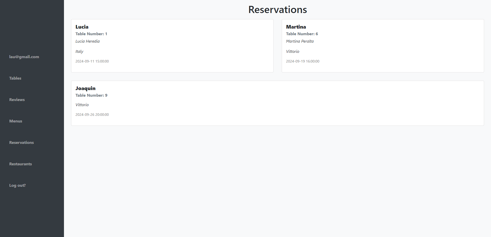

# Api de Gestion de Restaurantes de una zona comercial

El proyecto es una aplicación web que permite a los usuarios reservar mesas en diferentes restaurantes, ver menús, y calificar su experiencia. 
Los administradores de los restaurantes tendrán la capacidad de gestionar las reservas, menús y recibir feedback de los clientes.

# Funcionamiento

Roles: 

Cliente, Administrador de Restaurante.
Registro e inicio de sesión: Los usuarios podrán registrarse e iniciar sesión. Los administradores tendrán permisos adicionales.
Perfil de usuario: Los clientes podrán ver y editar su perfil, así como ver su historial de reservas.

Administración: 

Los administradores pueden agregar y editar la información del restaurante (nombre, dirección, horarios, etc.).
Gestión de mesas: Los administradores pueden configurar las mesas disponibles en el restaurante (número de asientos, disponibilidad, etc.).

Crear y ver reservas: 

Los clientes pueden buscar restaurantes y realizar reservas para una fecha y hora específicas.
Cancelar reservas: Los clientes pueden cancelar sus reservas antes de la fecha.

Agregar y editar menús: 

Los administradores pueden gestionar los menús de su restaurante, añadiendo y editando platos.
Visualización de menús: Los clientes pueden ver el menú de un restaurante antes de hacer una reserva.

Calificación de la experiencia: 

Después de una reserva, los clientes pueden calificar su experiencia y dejar comentarios.
Ver reseñas: Los administradores pueden ver las reseñas de los clientes.

# Lenguajes implementados

Java 17 con Spring Framework, HTML, CSS Y JavaScript

#

